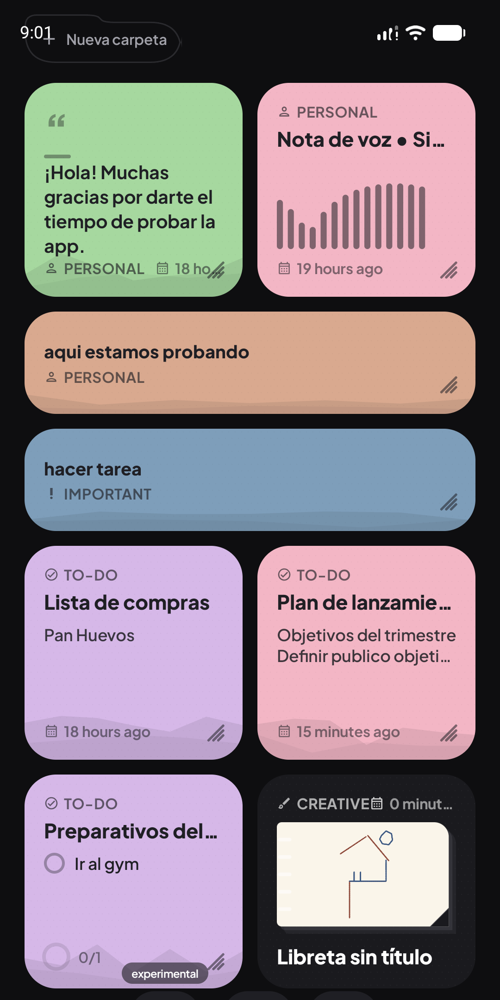
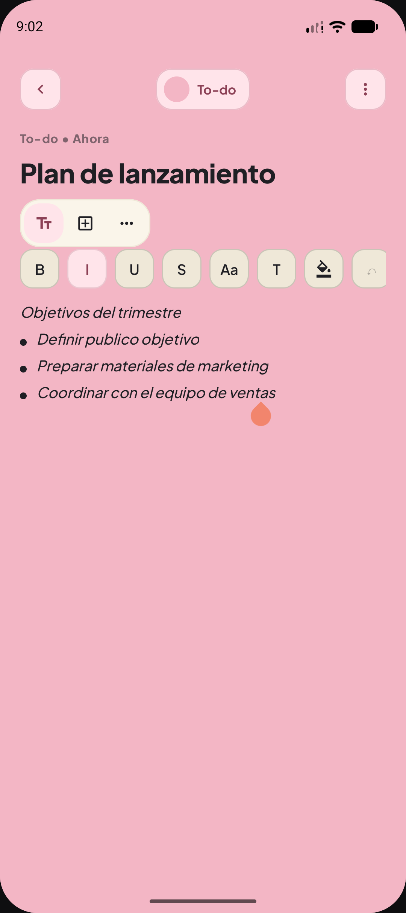
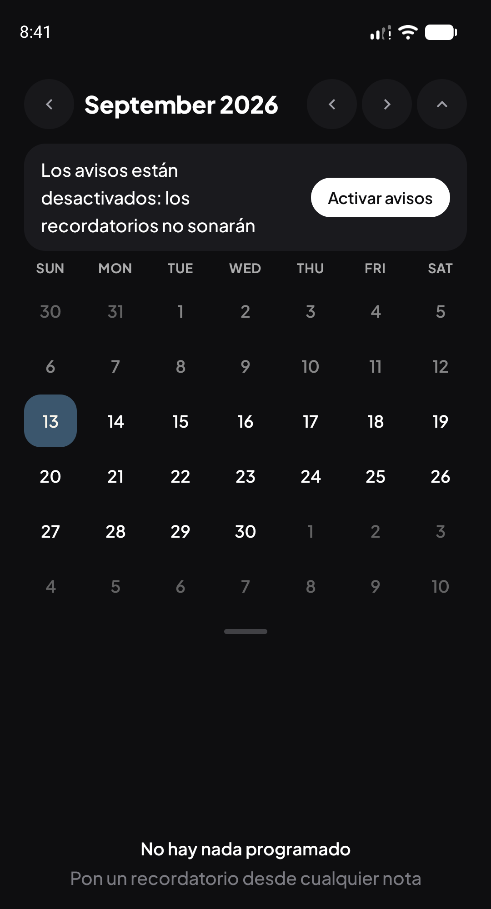
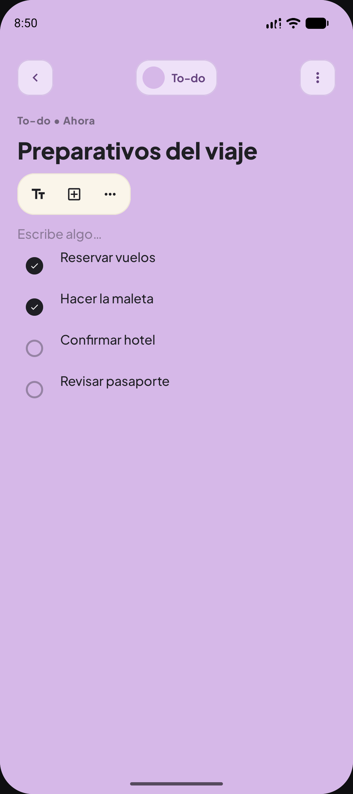
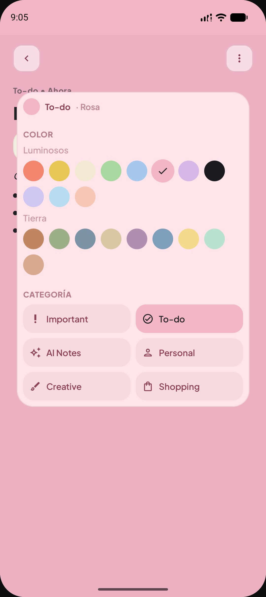
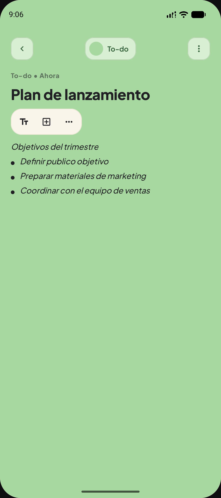

# My Notes

Tus notas, bonitas y siempre a la mano. Rápida, privada y sin cuentas.

> Pulsa arriba para descargar la última versión. Gratis, sin registro.

## Capturas

<table>
<tr>
<td align="center">
 
Dashboard con colores y categorías
</td>
<td align="center">
 
Edición de nota con formato
</td>
</tr>
<tr>
<td align="center">
 
Calendario y recordatorios
</td>
<td align="center">
 
Checklist para tachar tareas
</td>
</tr>
<tr>
<td align="center">
 
Panel de color + categoría
</td>
<td align="center">
 
Cambia de color al instante
</td>
</tr>
</table>

### Video de demostración

* [Abrir y cerrar una nota](capturas/videos/abrir_y_cerrar.mp4) — la animación al entrar y salir de una nota.
* [Scroll por el dashboard](capturas/videos/03_scroll_dashboard.mp4) — recorrido por las notas con distintos colores y categorías.
* [Marcar un checklist](capturas/videos/02_checklist_toggle.mp4) — tachar tareas en tiempo real.

## ¿Qué es?

My Notes es una app de notas para Android pensada para el día a día: apuntar rápido, ordenar sin esfuerzo y encontrar todo al instante. Todo se guarda en tu teléfono, funciona sin internet y sin crear cuentas.

## Lo que puedes hacer

**Escribir como quieras**
Títulos, listas, checklist para tachar, citas, tablas, fechas de calendario, fotos con pie, enlaces y tarjetas de vista previa cuando pegas un link.

**Ordenar sin pensar**
6 categorías: Importante, Pendientes, IA, Personal, Creativas y Compras. Más 20 colores, carpetas propias, favoritos y papelera. El color y la categoría se cambian juntos en un mismo panel.

**Que no se te olvide nada**
Recordatorios que te avisan y al tocarlos te llevan justo a esa parte de la nota. Búsqueda instantánea que encuentra hasta lo de tus checklist.

**Capturar de todo**
Notas de voz, stickers para decorar, lienzo libre para dibujar a mano alzada y 10 plantillas para empezar (lista de compras, diario, proyecto y más).

**Traer y llevar tus notas**
Trae tus notas de Google Keep, Markdown o texto. Saca respaldo en JSON, comparte en Markdown o exporta en PDF bonito tamaño A4.

**Un diseño que se siente bien**
Panel oscuro para ver todo, nota color papel para leer a gusto, animación suave al abrir cada nota y modo claro pastel opcional.

## Lo nuevo en la 0.3.4

* Panel renovado: color + categoría en el mismo lugar, se guarda al instante.
* Pega un enlace y se vuelve una tarjeta con título, descripción e imagen. Si no hay internet te deja reintentar. Funciona sin datos después de cargarla.
* Nuevo atajo de “Escribir aquí” para seguir escribiendo entre tarjetas y bloques.

Mira el historial completo en [Releases](https://github.com/AsahioO/My-Notes-/releases).

## Descargar e instalar

1. Entra a [Releases](https://github.com/AsahioO/My-Notes-/releases/latest) y descarga el `.apk`.
2. Ábrelo en tu celular y acepta “instalar apps desconocidas” cuando te lo pida.
3. Abre My Notes y empieza a escribir.

Requisitos: Android 8.0 o superior. Ligera, no pide permisos raros.

## Privacidad

Tus notas son tuyas. Viven en tu teléfono, no se suben a ningún servidor. Si borras la app sin respaldo, se pierden — usa la opción de Respaldo de vez en cuando.

## Autor

Hecha por **David Pérez (AsahioO)**.

¿Te gusta? Déjale una ⭐ al repo, ayuda mucho. Si algo falla, cuéntamelo en [Issues](https://github.com/AsahioO/My-Notes-/issues).
